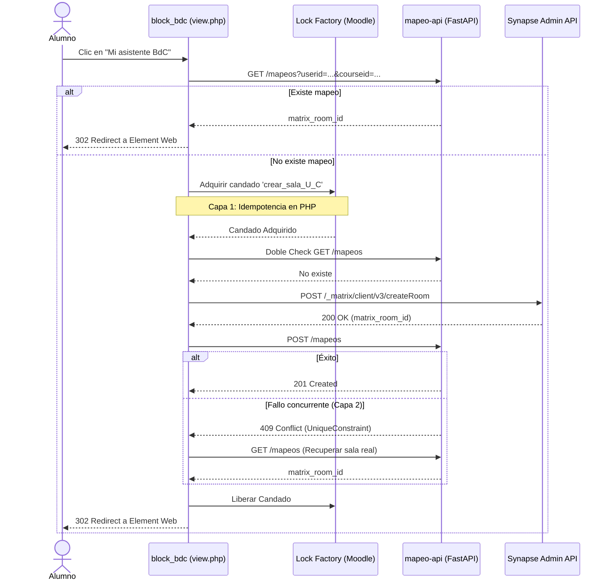

# Tabla de Mapeo Moodle-Matrix-GitHub

## Justificación Arquitectónica
Moodle 4.2+ incluye nativamente `communication/provider/matrix`, el cual asocia **una única sala compartida por curso**. Este modelo es incompatible con el requerimiento de salas privadas 1:1 por alumno. 
Por ello, se ha implementado el bloque `block_bdc` operando de forma totalmente aislada, comunicándose con un microservicio independiente (`mapeo-api`) que almacena una tabla de mapeo propia.

### Independencia del Subsistema Nativo
El bloque `block_bdc` genera su propia sala privada para el alumno. Se recomienda encarecidamente **desactivar** el subsistema nativo de Comunicación de Matrix en los cursos para evitar confusión cognitiva (el alumno no debe ver dos enlaces de chat distintos).

## Microservicio `mapeo-api`
En la Fase 2, se abstrajo el almacén de mapeos a un microservicio FastAPI + SQLite, asegurando el aislamiento arquitectónico. 

El modelo ORM subyacente maneja la triada relacional:
- `moodle_user_id` (Integer, Unique con course_id)
- `moodle_course_id` (Integer)
- `github_fork_url` (String)
- `matrix_room_id` (String)

## Flujo de Creación (block_bdc)
El siguiente diagrama detalla la arquitectura de idempotencia implementada en `block_bdc/view.php` para evitar salas duplicadas al hacer doble-clic:

