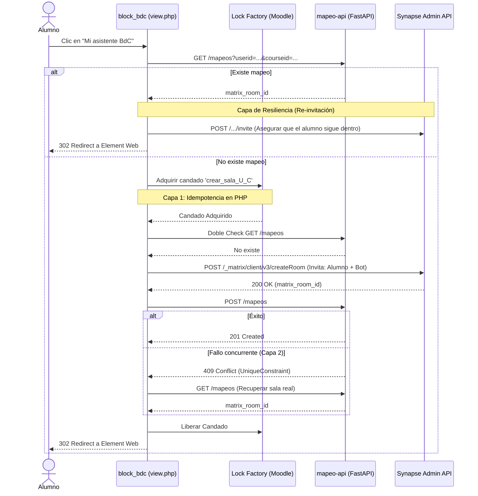

# Modelo Alumno-Repositorio-Sala {#mapeo_alumno_repositorio}

*(Nota: Anteriormente referenciado como `mapeo-alumno-fork.md` en versiones antiguas de la documentación. Si llegaste aquí por un enlace antiguo, estás en el documento correcto).*

## Justificación Arquitectónica
Moodle 4.2+ incluye nativamente `communication/provider/matrix`, el cual asocia **una única sala compartida por curso**. Este modelo es incompatible con el requerimiento de salas privadas 1:1 por alumno. 
Por ello, se ha implementado el bloque `block_bdc` operando de forma totalmente aislada, comunicándose con un microservicio independiente (`mapeo-api`) que almacena una tabla de mapeo propia.

### Independencia del Subsistema Nativo
El bloque `block_bdc` genera su propia sala privada para el alumno. Se recomienda encarecidamente **desactivar** el subsistema nativo de Comunicación de Matrix en los cursos para evitar confusión cognitiva (el alumno no debe ver dos enlaces de chat distintos).

## Microservicio `mapeo-api`
En la Fase 2, se abstrajo el almacén de mapeos a un microservicio FastAPI + SQLite, asegurando el aislamiento arquitectónico. 

El modelo ORM subyacente maneja la entidad relacional:
- `moodle_user_id` (Integer, Unique con course_id)
- `moodle_course_id` (Integer)
- `repo_url` (String) - El repositorio destino aprovisionado.
- `official_repo_url` (String) - El repositorio oficial del profesor que sirve como `upstream`.
- `git_provider` (String) - El proveedor utilizado (github, gitlab, etc.).
- `matrix_room_id` (String) - La sala 1:1 privada.
- `estado` (String)

## Modelo "Generado desde Template" vs "Fork"
En la **Fase 5.1**, se migró el aprovisionamiento desde el modelo clásico de Fork hacia la API de "Generate from Template".
### ¿Por qué?
1. **Aislamiento en GitHub**: GitHub tiene limitaciones severas con Forks en repositorios privados: no permite tener la misma organización poseyendo un fork de un repositorio que ya posee. Y si el repositorio base es público, la red de forks es pública. 
2. **Material Oficial**: Al usar "Generate from Template", el nuevo repositorio arranca desconectado históricamente del repositorio base oficial. Esto previene colisiones indeseadas y limita la visibilidad.
### El Precio Arquitectónico: Upstream Manual
Como el repositorio del estudiante nace desconectado (sin tracking `origin`/`upstream` nativo de GitHub hacia el profesor), el worker de sincronización (**Sync Worker**) tiene que **construir manualmente el remote upstream**. 
Cuando se dispara el webhook `POST /sync/oficial-updated` desde el repositorio del profesor, el Worker clona el repo del alumno, inyecta `git remote add upstream <official_repo_url>`, hace un `git fetch upstream` y extrae selectivamente (`git archive`) el contenido de la carpeta `material-oficial/` para volcarlo en el repositorio del estudiante y hacerle push al `origin` del estudiante.

## Flujo de Creación (block_bdc)
El siguiente diagrama detalla la arquitectura de idempotencia implementada en `block_bdc/view.php` para evitar salas duplicadas al hacer doble-clic:

### Tolerancia a Fallos en Salas Matrix
1. **Auto-Join del Asistente**: En el instante de la creación de la sala, Moodle incluye explícitamente al bot (`@llm_wiki_bot:localhost`) en el vector `invite` de Synapse. El bot, configurado con "Autojoin", se une a la sala inmediatamente, sin intervención manual.
2. **Re-invitaciones Resilientes**: Si un alumno abandona manualmente su sala en Matrix (haciendo que pierda los permisos de acceso al ser una sala privada), volver a hacer clic en el bloque de Moodle disparará un endpoint de invitación contra Synapse antes de la redirección. Esto garantiza que el alumno nunca pierda el acceso definitivo a su chat.
